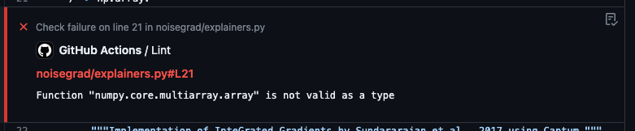

# `mypy` + `tox` GitHub Action

This is a GitHub Action to run `mypy` against your repository. 
It uses the new GitHub Actions API and JavaScript toolkit. 
It does fancy things like add annotations to your PRs inline.
Internally, it runs
```shell
tox run -e type
```
so make sure to have `tox.ini` define following environment:
```ini
[testenv:type]
description = run MyPy type checking
deps =
    mypy
commands =
    mypy .
```

Use it in your project like (in `.github/workflows/lint.yml`):
```yaml
name: Lint

on: [ push ]

jobs:
  type:
    runs-on: ubuntu-latest
    steps:
      - name: Checkout
        uses: actions/checkout@v3
      - name: Setup python for test ${{ matrix.py }}
        uses: actions/setup-python@v4
        with:
          #cache: 'pip'
          python-version: ${{ matrix.py }}
      - name: Install tox-gh
        run: pip install tox-gh
      - name: Setup tox environment
        run: tox run -e type --notest
      - name: Run Type Checking
        uses: aaarrti/mypy-github-action@v2
        with:
          checkName: 'type'   # NOTE: this needs to be the same as the job name
        env:
          GITHUB_TOKEN: ${{ secrets.GITHUB_TOKEN }}
``` 
After the run, you could see similar annotations on your PR:



# Acknowledgments

This GitHub Action was based of to [my-github-action](https://github.com/sasanquaneuf/mypy-github-action),
I just adapted to fit my concrete workflows.

## Publish to a distribution branch

Actions are run from GitHub repos so we will checkin the packed dist folder. 
Note: We recommend using the `--license` option for ncc, which will create a license file for all of the production node modules used in your project.

Then run [ncc](https://github.com/zeit/ncc) and push the results:
```bash
npm run build
npm run package
git add dist
git commit -a -m "prod dependencies"
git push origin releases/v1
```